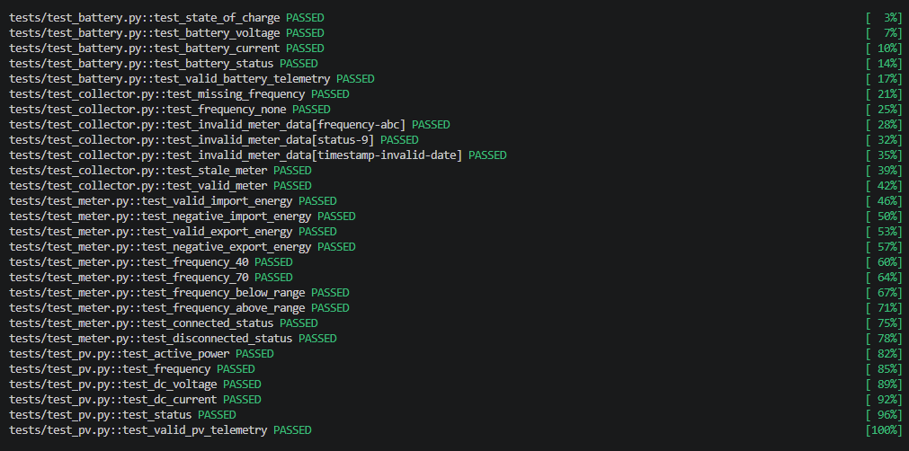

# Device Telemetry Collection

## Overview

- This project is a component for handling telemetry from electricity meters, PV inverters, and batteries.
- It accepts incoming telemetry, converts it into device-specific models, and applies validation rules.
- It distinguishes telemetry as `VALID`, `INVALID`, `MISSING`, or `STALE`.
- Device-specific validation is separated into individual services, while the collector handles routing, parsing, and stale data checks.
- Valid and stale telemetry can be exposed to downstream consumers.

## Assumptions

- Incoming telemetry is an already-decoded Python dictionary.
- Each message contains `device_type` and `telemetry`.
- Timestamps are ISO-8601 strings.
- Timestamps without timezone information are treated as UTC.
- Telemetry older than 60 seconds is considered stale.
- The stale threshold could be configurable in a production system.

## Architecture

```text
Raw payload
    ↓
TelemetryCollector
    ↓
Parse / missing checks
    ↓
Device model
    ↓
Device-specific service
    ↓
Stale check
    ↓
VALID / INVALID / MISSING / STALE
```

## Validation Rules

| Device  | Field           | Valid range/status |
| ------- | --------------- | ------------------ |
| Meter   | Import energy   | `>= 0`             |
| Meter   | Export energy   | `>= 0`             |
| Meter   | Frequency       | `40–70`            |
| PV      | Active power    | `0–5`              |
| PV      | Frequency       | `40–70`            |
| PV      | DC voltage      | `0–1`              |
| PV      | DC current      | `0–20`             |
| Battery | State of charge | `0–100`            |
| Battery | Battery voltage | `0–1`              |
| Battery | Battery current | `-10000–10000`     |

## Input Format

### Meter Payload

```json
{
  "device_type": "meter",
  "telemetry": {
    "import_energy": 100.0,
    "export_energy": 50.0,
    "frequency": 50.0,
    "status": 1,
    "timestamp": "2026-08-21T01:20:00+10:00"
  }
}
```

### PV Inverter Payload

```json
{
  "device_type": "pv_inverter",
  "telemetry": {
    "active_power": 3.5,
    "frequency": 50.0,
    "dc_voltage": 0.7,
    "dc_current": 10.0,
    "status": 2,
    "timestamp": "2026-08-21T01:20:00+10:00"
  }
}
```

### Battery Payload

```json
{
  "device_type": "battery",
  "telemetry": {
    "state_of_charge": 75.0,
    "battery_voltage": 0.8,
    "battery_current": -250.0,
    "status": 3,
    "timestamp": "2026-08-21T01:20:00+10:00"
  }
}
```

## Telemetry States

### VALID

- All required fields are present.
- Values can be parsed.
- All business validation rules pass.
- Timestamp is fresh.

### MISSING

- A required field is absent.
- A required field has a `None` value.

### INVALID

- Malformed value.
- Unsupported status.
- Value outside the allowed range.
- Invalid timestamp format.
- Malformed telemetry structure.

### STALE

- Telemetry is otherwise valid.
- Timestamp is more than 60 seconds old.

## Design

### TelemetryCollector

`src/device_telemetry/collector.py`

- Receives raw payloads.
- Identifies the device type.
- Checks for missing or malformed data.
- Converts raw values.
- Delegates device-specific validation.
- Checks telemetry staleness.

### Meter / PV / Battery Models

- `src/device_telemetry/meter/`
- `src/device_telemetry/pv/`
- `src/device_telemetry/battery/`

The models represent parsed telemetry for each supported device type.

### Device Services

Device services contain the validation rules specific to each device type.

### Common Types

`src/device_telemetry/common/types.py`

Contains shared enums such as device type and telemetry status.

## File Structure

```text
src/
└── device_telemetry/
    ├── collector.py
    ├── common/
    ├── meter/
    ├── pv/
    └── battery/
```

## Exposing Telemetry

- `VALID` telemetry can be exposed.
- `STALE` telemetry can also be exposed but is clearly marked as stale.
- `INVALID` or `MISSING` telemetry is not treated as usable telemetry.

### Sample Data

```json
{
  "device_type": "meter",
  "telemetry_status": "Valid Telemetry Data",
  "telemetry": {
    "import_energy": 100.0,
    "export_energy": 50.0,
    "frequency": 50.0,
    "status": 1,
    "timestamp": "2026-08-21T01:30:00+10:00"
  }
}
```

## Test Cases



Tests cover:

- Boundary conditions.
- Invalid ranges.
- Device statuses.
- Missing fields.
- Malformed values.
- Stale telemetry.

## Running Tests

Install the package in editable mode:

```bash
python -m pip install -e .
```

## Future Improvements

- Stale timeout could be configuration-driven.
- Common parsing could be extracted if many more device types are added.
- Transport/protocol integration is intentionally not implemented.
- A production system could add logging and metrics.
